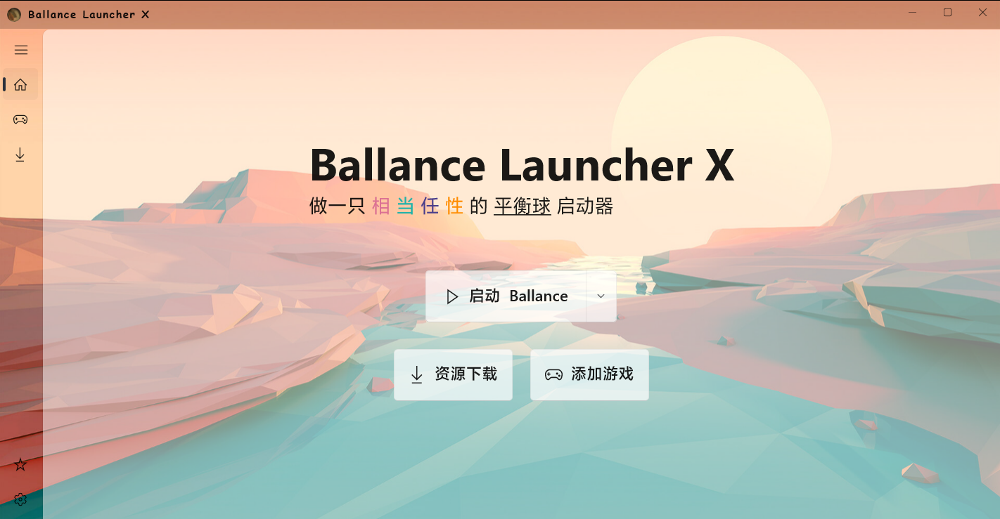
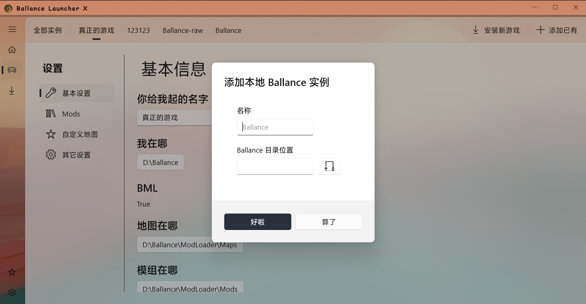
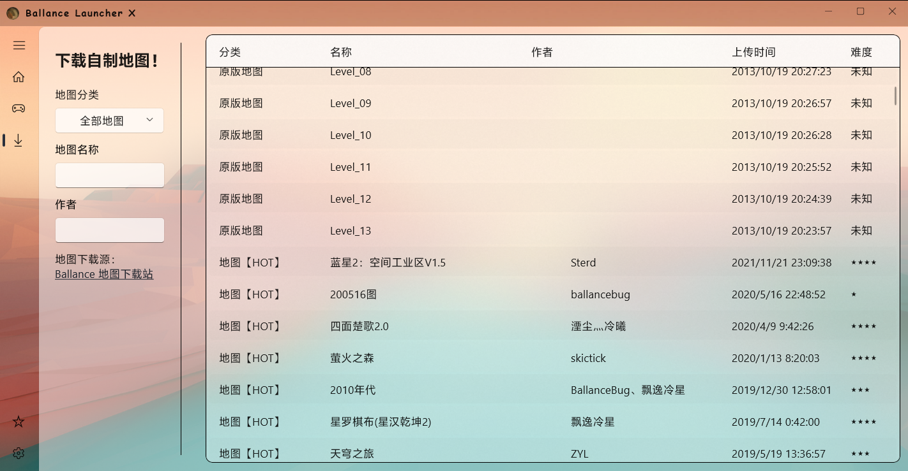

# Ballance Launcher

一个专为 Ballance（平衡球）中文社区打造的游戏启动器，基于 `WinUI 3` 项目构建



## 特性

-   实例化管理
    -   实例在线安装
-   Database.tdb 管理
    -   关卡解锁
    -   游戏内设置
    -   纪录管理
-   BML(+) 管理
    -   MOD、自制地图管理
    -   MOD 信息读取
-   在线下载地图、MOD、材质包等

### 预览图

添加实例



下载地图



### 即将实现的特性

-   MOD 下载
-   材质包下载、管理
-   音效下载、管理
-   管理已启动实例
-   DIY 背景图
-   Ballance 启动参数管理

### 兼容性

该项目仅兼容 Win10 1809 及以上的 WindowsOS，暂时不兼容其它操作系统，~~由于用了 WinUI 估计以后也不会支持~~

目前应用中的文字（中文）均直接内嵌编译，不确定是否会因编码问题造成显示错误，后续若推广至中文社区以外，则考虑独立出语言包

### 排错

浏览本地文件（夹）等操作在以管理员身份运行时可能会造成闪退，系 WinUI 3 的 bug，对应的 [issue](https://github.com/microsoft/WindowsAppSDK/issues/2504) 有讨论

## 自行编译

### 查看源代码

-   [源码路径](./BallanceLauncher/BallanceLauncher/)
-   [项目打包路径](<./BallanceLauncher/BallanceLauncher%20(Package)/>)

### 依赖

NuGet

-   [Microsoft.WindowsAppSDK](https://github.com/microsoft/windowsappsdk) 1.1.4
-   [Newtonsoft.Json](https://www.newtonsoft.com/json) 13.0.1
-   [WpfCore.FolderPicker](https://github.com/dove-team/WpfCore.FolderPicker) 1.0.0
-   [Swung0x48.Ballance.TdbReader](https://www.nuget.org/packages/Swung0x48.Ballance.TdbReader/1.1.0) 1.1.0
-   [System.Data.HashFunction.CRC](https://www.nuget.org/packages/System.Data.HashFunction.CRC/2.0.0?_src=template) 2.0.0

其它依赖

-   [BallanceModLoader](https://github.com/Gamepiaynmo/BallanceModLoader)
-   [BallanceModInfoReader](https://github.com/Swung0x48/BallanceModInfoReader)
-   Ballance 游戏本体
    -   [Ballance 资源下载站](http://ys.bcrc.site/)核心目录内的任一 Ballance 均可

### 编译

1. 克隆项目

```
git clone https://github.com/Ghomist/BallanceLauncher.git
```

2. 使用 Visual Studio 2022 打开 `BallanceLauncher.sln`

<!-- 3. 设置需内嵌编译的二进制文件，并设置其编译属性

以下路径均相对该源码根目录：[`./BallanceLauncher/BallanceLauncher/`](./BallanceLauncher/BallanceLauncher/)

| 文件项                                            | 编译属性 | 备注            |
| ------------------------------------------------- | -------- | --------------- |
| `Ballance/Ballance.zip`                           | Embedded |                 |
| `Ballance/BML-0.3.40.zip`                         | Embedded |                 |
| `BallanceModInfoReader/BallanceModInfoReader.exe` | Embedded |                 |
| `BallanceModInfoReader/BML.dll`                   | Embedded | 该 BML 为简化版 | -->

3. 选择 Release 64x 配置文件

4. 构建解决方案并部署

## 一些废话

下面的废话都可以在启动器的关于界面找到，~~所以别看了叭！！！~~

~~**欢迎来 Ballance 吧一起玩！这里甚至可以聊 Ballance！**~~

本项目大致用途是将目前各种散乱的资源、教程集成在一个应用内，新手可以方便下载安装自制地图、Mod 等资源；考虑到相当多的竞速/制图玩家，或者是 Moder 们，会在电脑里装上好几个 Ballance 分别有不同的用处，于是这个启动器采用实例管理的方式（不同于以往工具箱）

本项目使用 WinUI 3 (C#) 实现，所以很抱歉它并不兼容低版本 Windows，更别说其它的系统了，不过正因为有了 WinUI 3 你们才能看到这样舒服的 UI 界面

~~（其实主要是我想玩 WinUI 3 于是就做了这个小项目哈哈哈）~~

### 一些有用的链接

-   [Ballance 社区资源中心](https://bcrc.site/)
-   [地图下载站](http://ballancemaps.ysepan.com/)
-   [Ballance 中文 Wiki](https://ballance.jxpxxzj.cn/wiki/%E9%A6%96%E9%A1%B5)
-   [我的 ys 网盘](http://ghostmisser.ysepan.com/)

### 特别鸣谢

-   四汪（[Swung 0x48](https://github.com/Swung0x48)）：友情提供 BallanceModInfoReader，让我的启动器可以读取 bmod 内部信息；以及一些相当不错的技术支持！

-   BallanceBug（[Xenapte](https://github.com/Xenapte)）：地图下载站支持、Mod 整理；（以及下面的 'ballancemaps-fetch' 就是 bug 主导开发的！）

### 相关项目

[ballancemaps-fetch](https://github.com/TeamKambuchi/ballancemaps-fetch)
